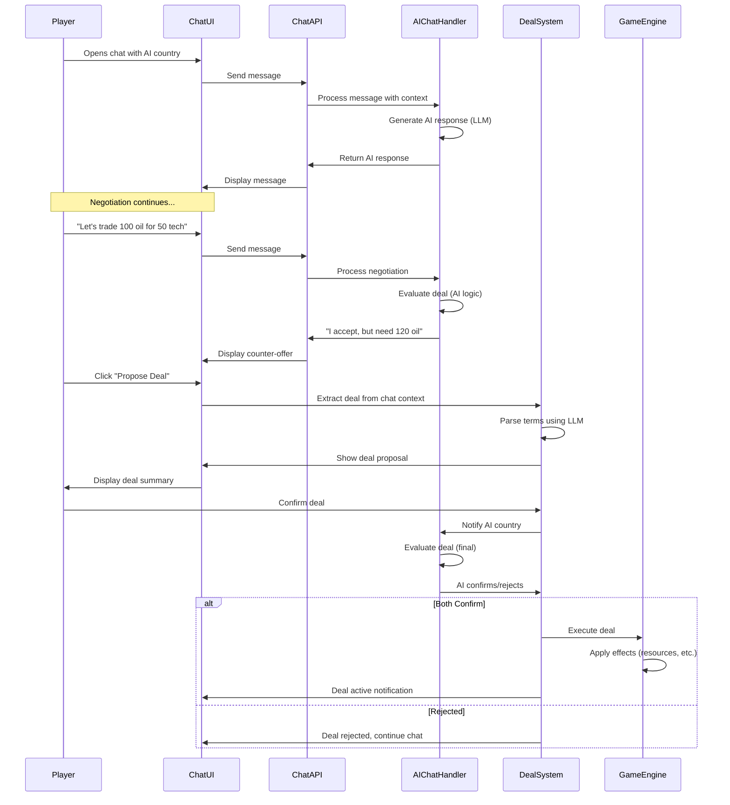

# Strato Game - Initial Architecture Plan

## Overview

Build a web-based turn-based strategy game where players manage a country competing with AI-controlled countries. Starting with 6 countries for development, but architected to scale to many countries. The architecture will be modular and extensible to support future multiplayer, advanced AI personalities, and complex world events. Features a unique chat-based diplomacy system where players negotiate deals through free-form conversation with AI countries.

## Tech Stack

- **Frontend**: Next.js 14+ (App Router) with TypeScript
- **Backend**: Supabase (PostgreSQL database, Auth, Realtime)
- **Deployment**: Vercel
- **State Management**: Zustand or React Context (for game state)
- **AI**: Custom decision engine with LLM integration for chat-based diplomacy
- **LLM Integration**: OpenAI API or similar for AI country chat responses (can be configured)

## Project Structure

```
strato/
├── app/                          # Next.js App Router
│   ├── (game)/                   # Game routes (protected)
│   │   ├── game/[id]/            # Individual game session
│   │   │   ├── page.tsx          # Main game view
│   │   │   └── components/       # Game-specific components
│   │   └── new-game/             # Create new game
│   ├── api/                      # API routes
│   │   ├── game/                 # Game management endpoints
│   │   ├── turn/                 # Turn processing
│   │   ├── ai/                   # AI decision endpoints
│   │   ├── chat/                 # Chat message endpoints
│   │   └── deals/                # Deal management endpoints
│   ├── layout.tsx
│   └── page.tsx                  # Landing/home page
├── components/                   # Shared components
│   ├── game/
│   │   ├── Map.tsx               # Country map visualization
│   │   ├── CountryPanel.tsx      # Country info display
│   │   ├── ActionPanel.tsx       # Player action interface
│   │   ├── TurnIndicator.tsx    # Turn status
│   │   ├── ResourceDisplay.tsx   # Resources/statistics
│   │   ├── DiplomacyChat.tsx     # Chat interface for diplomacy
│   │   ├── DealProposal.tsx      # Deal proposal/confirmation UI
│   │   └── ActiveDeals.tsx       # List of active/pending deals
│   └── ui/                       # Reusable UI components
├── lib/
│   ├── supabase/                 # Supabase client & utilities
│   │   ├── client.ts
│   │   └── types.ts              # Generated database types
│   ├── game-engine/              # Core game logic
│   │   ├── GameState.ts          # Game state management
│   │   ├── TurnProcessor.ts     # Turn resolution logic
│   │   ├── ActionResolver.ts    # Action execution
│   │   ├── EventSystem.ts        # Event handling (future-proof)
│   │   └── DealExecutor.ts      # Deal execution and enforcement
│   ├── ai/                       # AI decision system
│   │   ├── AIController.ts       # Main AI orchestrator
│   │   ├── StrategicPlanner.ts  # Strategic decision making
│   │   ├── DiplomacyAI.ts       # Diplomatic AI
│   │   ├── EconomicAI.ts        # Economic planning AI
│   │   ├── MilitaryAI.ts        # Military strategy AI
│   │   ├── Personality.ts       # AI personality system (extensible)
│   │   └── ChatHandler.ts       # AI chat response handler (LLM integration)
│   └── utils/                    # Utility functions
├── types/                        # TypeScript type definitions
│   ├── game.ts                   # Game-related types
│   ├── country.ts                # Country-related types
│   ├── actions.ts                # Action types
│   ├── chat.ts                   # Chat message types
│   └── deals.ts                  # Deal types
├── supabase/
│   ├── migrations/               # Database migrations
│   │   └── 001_initial_schema.sql
│   └── seed.sql                  # Initial data (6 countries)
└── public/                       # Static assets
```

## Database Schema (Supabase)

### Core Tables

**games**

- `id` (uuid, primary key)
- `name` (text)
- `current_turn` (integer, default: 1)
- `status` (enum: 'active', 'paused', 'finished')
- `created_at`, `updated_at`
- `player_country_id` (uuid, foreign key to countries)

**countries**

- `id` (uuid, primary key)
- `game_id` (uuid, foreign key)
- `name` (text)
- `is_player_controlled` (boolean)
- `color` (text) - for map visualization
- `position_x`, `position_y` (numeric) - for map layout

**country_stats** (extensible attributes)

- `id` (uuid, primary key)
- `country_id` (uuid, foreign key)
- `turn` (integer) - for historical tracking
- `population` (integer)
- `budget` (numeric)
- `technology_level` (numeric)
- `military_strength` (integer)
- `military_equipment` (jsonb) - flexible structure
- `resources` (jsonb) - {resource_type: amount}
- `diplomatic_relations` (jsonb) - {country_id: relation_score}
- `created_at`

**actions** (player and AI actions)

- `id` (uuid, primary key)
- `game_id` (uuid, foreign key)
- `country_id` (uuid, foreign key)
- `turn` (integer)
- `action_type` (enum: 'diplomacy', 'military', 'economic', 'research')
- `action_data` (jsonb) - flexible action parameters
- `status` (enum: 'pending', 'executed', 'failed')
- `created_at`

**turn_history** (for replay/analysis)

- `id` (uuid, primary key)
- `game_id` (uuid, foreign key)
- `turn` (integer)
- `state_snapshot` (jsonb) - full game state at turn end
- `events` (jsonb) - events that occurred
- `created_at`

**diplomacy_chats** (chat conversations between countries)

- `id` (uuid, primary key)
- `game_id` (uuid, foreign key)
- `country_a_id` (uuid, foreign key to countries)
- `country_b_id` (uuid, foreign key to countries)
- `last_message_at` (timestamp)
- `created_at`, `updated_at`

**chat_messages** (individual messages in diplomacy chats)

- `id` (uuid, primary key)
- `chat_id` (uuid, foreign key to diplomacy_chats)
- `sender_country_id` (uuid, foreign key to countries)
- `message_text` (text)
- `is_ai_generated` (boolean) - true for AI country messages
- `created_at`

**deals** (diplomatic agreements between countries)

- `id` (uuid, primary key)
- `game_id` (uuid, foreign key)
- `proposing_country_id` (uuid, foreign key to countries)
- `receiving_country_id` (uuid, foreign key to countries)
- `deal_type` (enum: 'trade', 'alliance', 'non_aggression', 'military_aid', 'technology_share', 'custom')
- `deal_terms` (jsonb) - structured deal details:
  - `proposer_commitments`: [{type, resource, amount, duration}]
  - `receiver_commitments`: [{type, resource, amount, duration}]
  - `conditions`: [conditional terms]
- `status` (enum: 'draft', 'proposed', 'accepted', 'rejected', 'active', 'completed', 'violated')
- `proposed_at` (timestamp)
- `accepted_at` (timestamp)
- `expires_at` (timestamp, nullable) - for time-limited deals
- `turn_created` (integer)
- `turn_expires` (integer, nullable)
- `created_at`, `updated_at`

**deal_confirmations** (track deal acceptance/rejection)

- `id` (uuid, primary key)
- `deal_id` (uuid, foreign key to deals)
- `country_id` (uuid, foreign key to countries)
- `action` (enum: 'propose', 'accept', 'reject', 'modify')
- `message` (text, nullable) - optional message with confirmation
- `created_at`

## Core Game Mechanics

### Turn Structure

1. **Action Phase**: Player and AI countries submit actions
2. **Resolution Phase**: Actions are processed and resolved
3. **Update Phase**: Country stats update (resources, population, etc.)
4. **Event Phase**: Random events and consequences occur
5. **AI Decision Phase**: AI countries plan next turn

### Country Attributes (Initial)

- **Population**: Affects workforce, military capacity, tax revenue
- **Budget**: Currency for actions
- **Resources**: Raw materials (oil, minerals, food, etc.)
- **Technology Level**: Unlocks capabilities and efficiency
- **Military Strength**: Combat effectiveness
- **Military Equipment**: Tanks, aircraft, ships (stored as JSONB)
- **Diplomatic Relations**: Relationship scores with other countries

### Action Types (Initial)

- **Diplomacy**: Trade agreements, alliances, declarations (negotiated via chat)
- **Military**: Deployments, attacks, defense spending
- **Economic**: Resource extraction, trade, infrastructure
- **Research**: Technology advancement

### Chat-Based Diplomacy System

A unique feature where players negotiate deals through free-form text conversation with AI countries, rather than selecting from pre-made options.

**Workflow:**

1. Player opens chat with an AI country
2. Both parties exchange messages discussing potential deals
3. When a deal is discussed, either party can propose a formal deal
4. Deal proposal shows structured summary of terms
5. Both parties must confirm to activate the deal
6. Once confirmed, deal is executed and enforced by the game engine

**Deal Types:**

- **Trade**: Resource exchanges, budget transfers
- **Alliance**: Mutual defense agreements
- **Non-Aggression**: Peace pacts
- **Military Aid**: Equipment or budget sharing
- **Technology Share**: Technology level improvements
- **Custom**: Complex multi-term agreements

**Deal Proposal & Confirmation Workflow:**

1. **Negotiation Phase** (Chat):

   - Players and AI discuss potential deals in natural language
   - AI evaluates proposals based on country interests
   - Both parties can suggest modifications

2. **Deal Proposal**:

   - Either party can click "Propose Deal" button during chat
   - System extracts deal terms from conversation context using LLM
   - Structured deal proposal is generated showing:
     - Deal type
     - What each party commits to (resources, budget, actions)
     - Duration/expiration terms
     - Conditions (if any)
   - Proposal is saved with status 'proposed'

3. **Deal Review**:

   - Receiving party sees deal proposal notification
   - Can view detailed deal summary in dedicated UI panel
   - Can accept, reject, or request modifications
   - Can continue chatting to negotiate changes

4. **Deal Confirmation**:

   - Both parties must explicitly confirm the deal
   - Confirmation UI shows final terms clearly
   - Once both confirm, deal status changes to 'active'
   - Deal is executed immediately or at turn start (depending on deal type)

5. **Deal Execution**:

   - `DealExecutor` processes active deals each turn
   - Transfers resources, applies effects, tracks compliance
   - Deals can be time-limited (expire after N turns) or permanent
   - Violations can be tracked (future: reputation system)

**Alternative Approach Consideration:**

- Instead of explicit "Propose Deal" button, system could auto-detect when both parties agree in chat
- LLM could identify when a deal is reached and automatically generate proposal
- This would feel more natural but might be less reliable
- **Recommended**: Hybrid approach - auto-suggest deals when agreement detected, but require explicit proposal for clarity

**Chat & Deal Flow Diagram:**



**AI Chat Behavior:**

- AI countries understand natural language negotiations
- AI evaluates deals based on country's best interests
- AI can propose counter-offers and modifications
- AI considers diplomatic relations, threats, and opportunities
- AI personality affects negotiation style (future enhancement)

## AI System Architecture

### Modular AI Design

The AI system will be modular with separate modules for different decision domains:

1. **StrategicPlanner**: High-level goals and priorities
2. **DiplomacyAI**: Relationship management, alliance building
3. **EconomicAI**: Resource management, trade decisions
4. **MilitaryAI**: Defense and offense strategies
5. **Personality**: Adjustable traits (future: dictator, democratic, etc.)

### AI Decision Flow

```
1. Assess current situation (threats, opportunities, resources)
2. Set priorities based on country needs
3. Generate candidate actions for each priority
4. Evaluate actions (cost/benefit analysis)
5. Select best actions within budget constraints
6. Execute actions
```

### Initial AI Behavior

- Act in country's best interest (maximize security, prosperity)
- Balance short-term and long-term goals
- React to player actions and other AI countries
- Form temporary alliances when beneficial
- Consider military threats and economic opportunities

### AI Chat System

The AI chat system uses LLM integration to enable natural language diplomacy:

**Chat Processing:**

1. Player sends message to AI country
2. System gathers context: current game state, country stats, diplomatic relations, recent events
3. LLM generates response considering:

   - Country's strategic goals
   - Current diplomatic relations
   - Available resources and needs
   - Recent game events
   - Country personality traits

4. AI response is natural and contextually appropriate
5. AI can propose deals, accept/reject proposals, or continue negotiation

**Deal Extraction:**

- System monitors chat for deal proposals
- Uses LLM to extract structured deal terms from natural language
- Validates deal terms against game rules
- Presents structured deal proposal for confirmation

**Implementation Options:**

- **Option 1**: Use OpenAI API (GPT-4) for chat responses
- **Option 2**: Use Anthropic Claude API
- **Option 3**: Use open-source LLM (via API or self-hosted)
- **Fallback**: Rule-based system if LLM unavailable (basic responses)

## Implementation Phases

### Phase 1: Foundation

- Set up Next.js project with TypeScript
- Configure Supabase connection
- Create database schema and migrations
- Basic UI structure (map placeholder, country panels)

### Phase 2: Core Game Engine

- Game state management
- Turn processing system
- Basic country attributes and stats
- Action system framework

### Phase 3: Player Interface

- Map visualization (scalable layout, starting with 6 countries)
- Country information display
- Action selection interface
- Turn progression UI
- Diplomacy chat interface
- Deal proposal and confirmation UI

### Phase 4: AI System

- Basic AI decision engine
- Strategic planning module
- Action execution for AI countries
- AI action visualization
- AI chat handler with LLM integration
- Deal proposal extraction from chat
- AI deal evaluation and negotiation logic

### Phase 5: Game Mechanics

- Resource system
- Economic calculations
- Military system basics
- Diplomacy framework
- Deal execution system
- Deal enforcement and tracking
- Chat-based negotiation flow

### Phase 6: Polish & Testing

- Balance adjustments
- UI improvements
- Error handling
- Performance optimization

## Future-Proofing Considerations

1. **Scalable Country System**: Database and map system designed to handle many countries (not limited to 6)
2. **Multiplayer Ready**: Database schema supports multiple players per game; chat system works for player-to-player communication
3. **Extensible AI**: Personality system allows different AI behaviors and negotiation styles
4. **Event System**: Framework for random events, revolutions, protests
5. **Modular Actions**: JSONB action_data allows new action types without schema changes
6. **Historical Data**: Turn history enables replay and analysis; chat history preserved
7. **Scalable Map**: Position system supports transition to real world map with many countries
8. **LLM Integration**: Chat system uses LLM for natural diplomacy; can be enhanced further
9. **Deal Flexibility**: JSONB deal_terms allows complex, custom agreements without schema changes
10. **Chat Architecture**: Real-time chat using Supabase Realtime, ready for multiplayer

## Key Files to Create

1. `supabase/migrations/001_initial_schema.sql` - Database schema (including chat and deals tables)
2. `lib/supabase/client.ts` - Supabase client setup
3. `lib/game-engine/GameState.ts` - Core game state management
4. `lib/game-engine/DealExecutor.ts` - Deal execution and enforcement
5. `lib/ai/AIController.ts` - Main AI orchestrator
6. `lib/ai/ChatHandler.ts` - AI chat response handler with LLM integration
7. `app/(game)/game/[id]/page.tsx` - Main game view
8. `app/api/chat/route.ts` - Chat message API endpoint
9. `app/api/deals/route.ts` - Deal management API endpoint
10. `components/game/Map.tsx` - Scalable map visualization component
11. `components/game/DiplomacyChat.tsx` - Chat interface component
12. `components/game/DealProposal.tsx` - Deal proposal/confirmation component
13. `types/game.ts` - TypeScript definitions
14. `types/chat.ts` - Chat message types
15. `types/deals.ts` - Deal types and structures

## Next Steps After Plan Approval

1. Initialize Next.js project with TypeScript
2. Set up Supabase project and configure connection
3. Create database migrations
4. Build core game engine and state management
5. Implement basic UI and game loop
6. Develop AI system
7. Add game mechanics and balance
8. Deploy to Vercel and configure Supabase